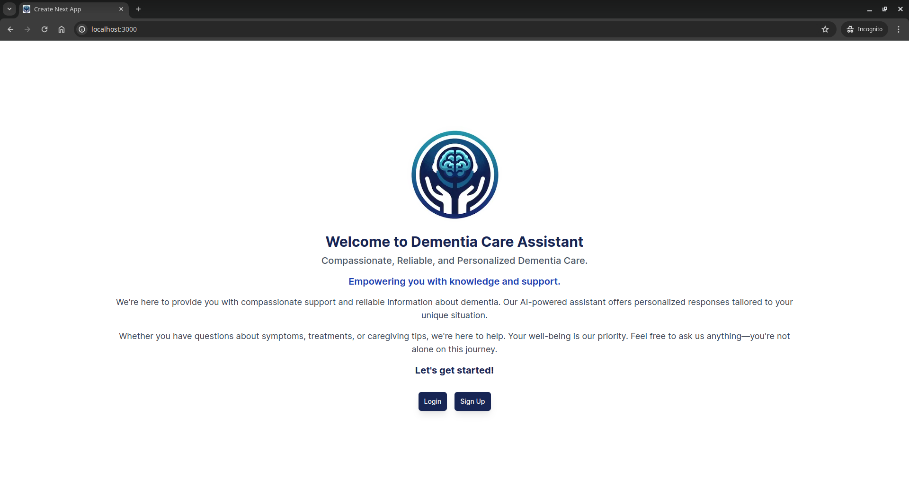
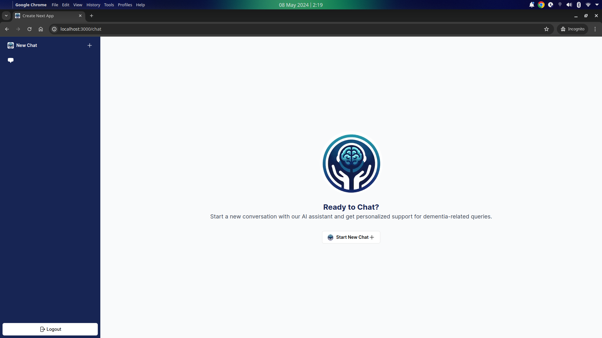
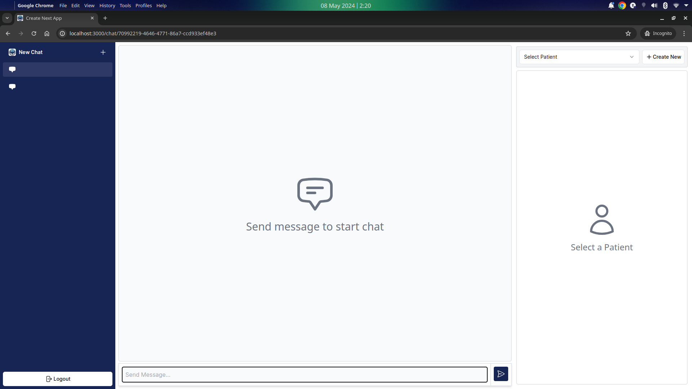

## Getting Started

To run the project locally, follow the steps:

1. Install docker and docker compose [guide to install](https://docs.docker.com/desktop/install/ubuntu/)
2. clone the repository,
     a. `$ git clone https://github.com/divy-vinayak/apple-slice.git`
3. `$ cd apple-slice`
4. Rename the **.env.example** file to **.env**
5. Put your openAI api key inside the **.env** file , if you're not using any self hosted LLM model.
6. In the root of the project, open terminal and run the following commands
   a. `$ docker compose up`
7. In another terminal, run
   a. `$ docker exec -it apple-slice-app /bin/bash`
   b. `$ npx prisma migrate dev`
   c. `$ exit`
8. Navigate to localhost:3000
9. Go to Signup and register with a user and start playing with the application

## UI

